# Taller 2 - Analisis Datos

## 1. Configuración imagen SQL Server

Descargamos la imagen de SQL Server y confirmamos que ese proceso fue exitoso.
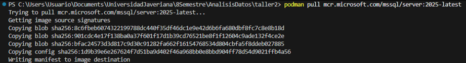
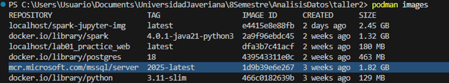

## 2. Corremos el container con los datos disonibles y observamos que la base de datos AdventureWorks ya se encuentra en dicho contenedor.
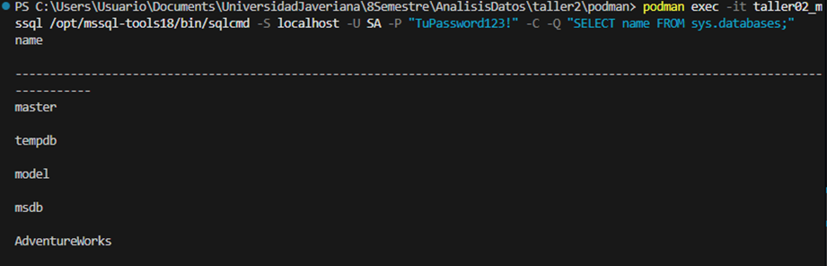

## 3. Generación de data y schema apartir del backup.

Este proceso lo realicé con SQL Server Management que da la opción de gener
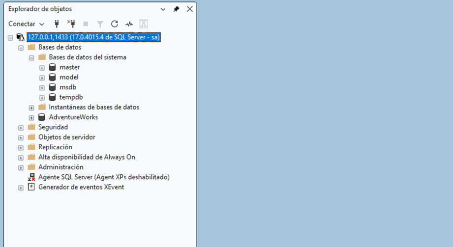

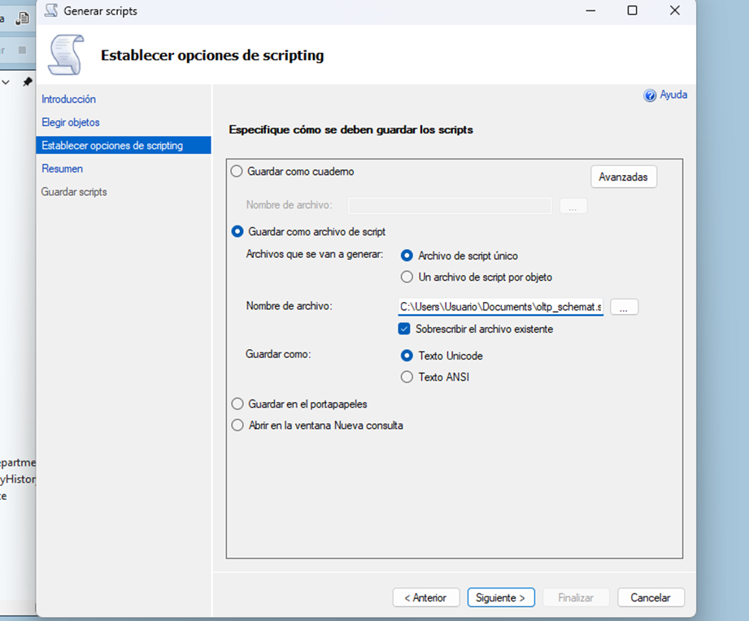
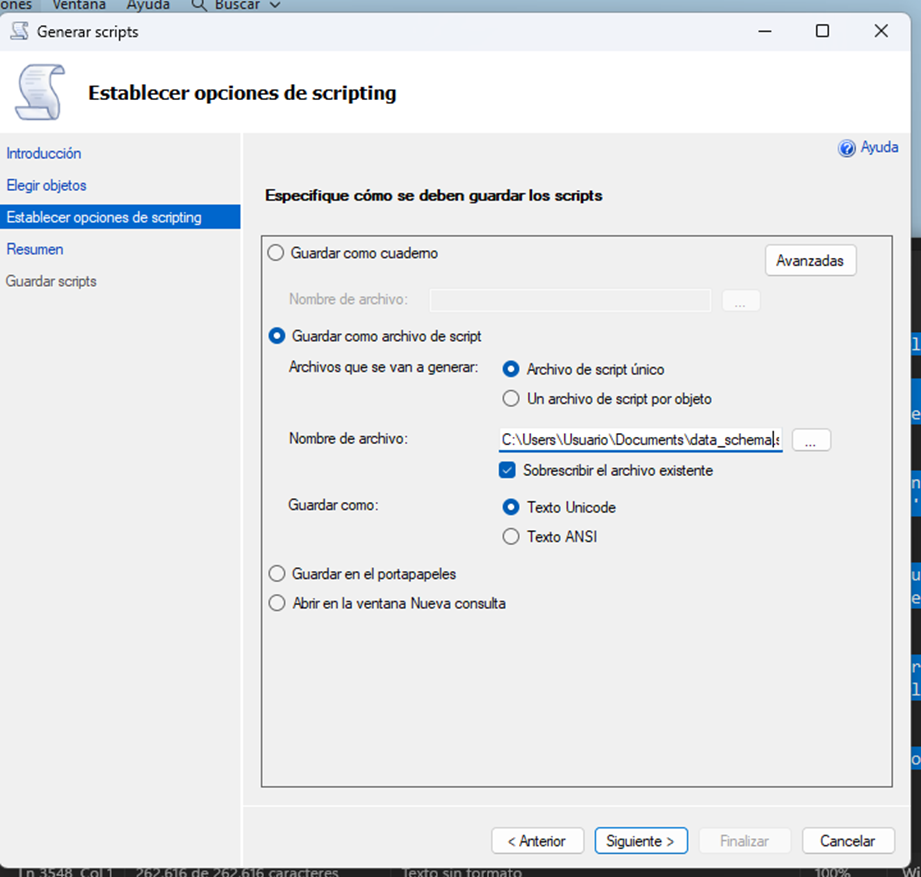
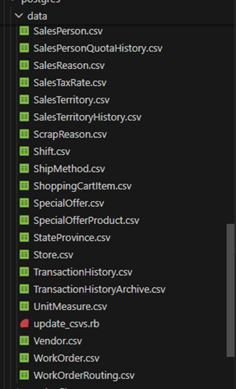
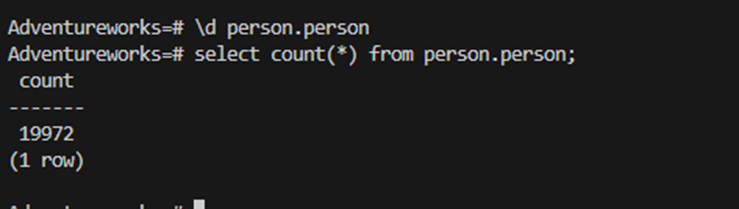
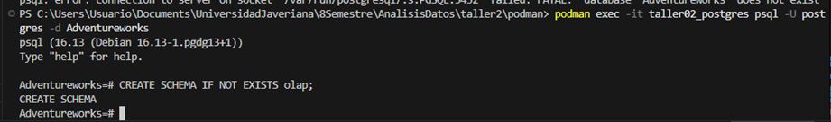
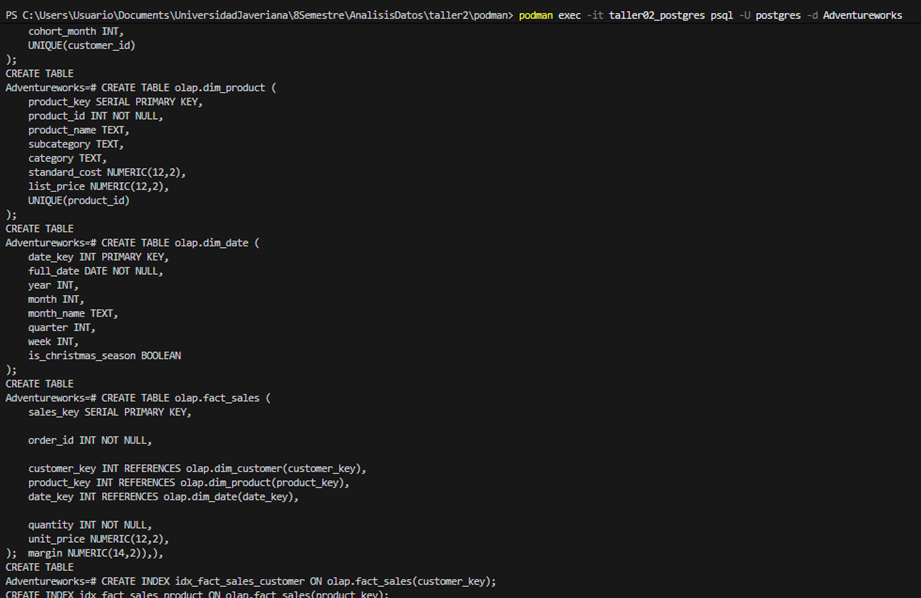
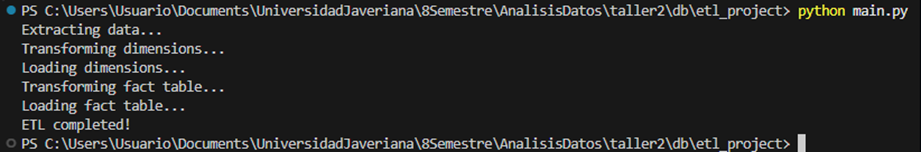
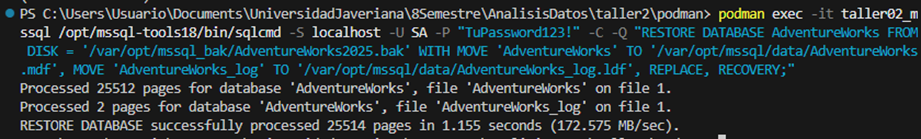
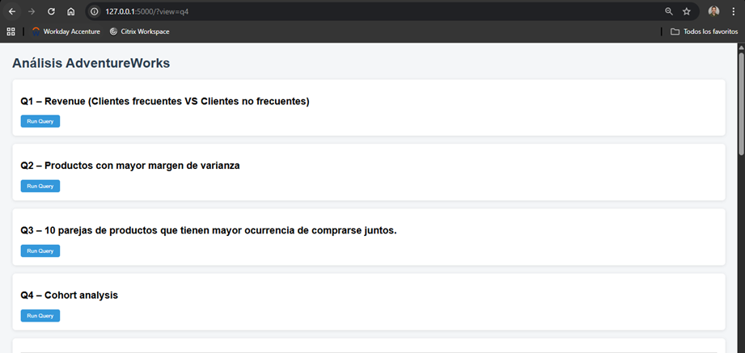
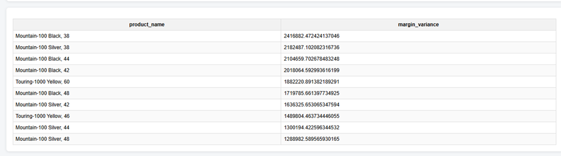
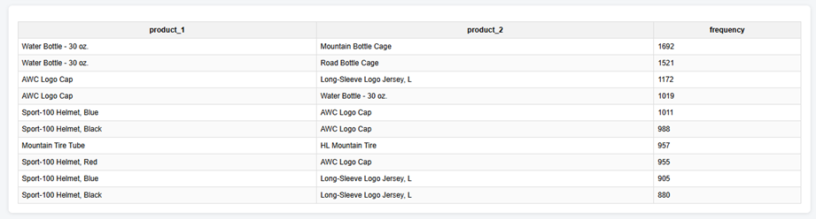

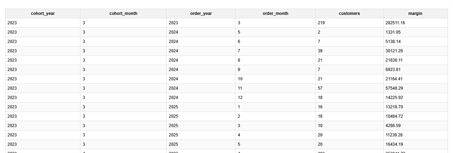
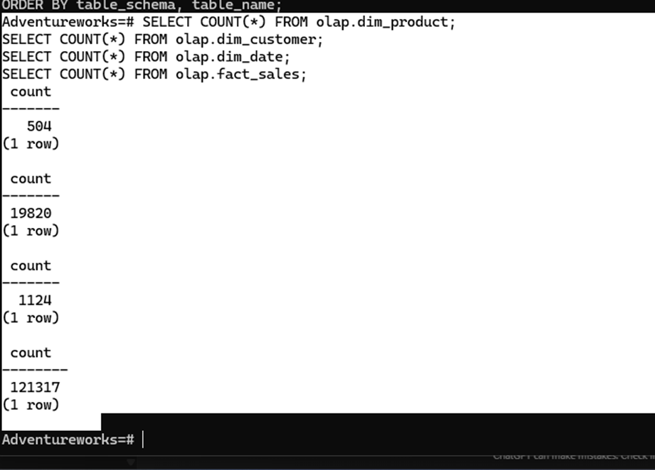